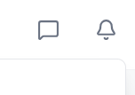

# Frontend Notification Quick Start

Get your frontend notifications running in 10 minutes!

## Step 1: Install Dependencies (2 minutes)

```bash
: 
```

## Step 2: Configure Echo (2 minutes)

Create `src/config/echo.js`:

```javascript
import Echo from 'laravel-echo';
import Pusher from 'pusher-js';

window.Pusher = Pusher;

export const initializeEcho = (authToken) => {
    window.Echo = new Echo({
        broadcaster: 'pusher',
        key: 'a0b93b5b3a7936dfac19',
        cluster: 'ap2',
        forceTLS: true,
        authEndpoint: 'http://127.0.0.1:8000/broadcasting/auth',
        auth: {
            headers: {
                Authorization: `Bearer ${authToken}`,
                Accept: 'application/json',
            },
        },
    });
    return window.Echo;
};
```

## Step 3: Copy Components (3 minutes)

Copy these files from `FRONTEND_NOTIFICATION_IMPLEMENTATION.md`:
- NotificationContext.jsx
- NotificationBell.jsx

## Step 4: Integrate in App (2 minutes)

```javascript
import { NotificationProvider } from './contexts/NotificationContext';
import NotificationBell from './components/NotificationBell';
import { ToastContainer } from 'react-toastify';
import 'react-toastify/dist/ReactToastify.css';

function App() {
    const user = /* your user object */;
    const token = /* your auth token */;

    return (
        <NotificationProvider user={user} token={token}>
            <header>
                <NotificationBell />
            </header>
            <ToastContainer />
        </NotificationProvider>
    );
}
```

## Step 5: Test (1 minute)

```bash
# Backend: Send test notification
php artisan notifications:test all

# Frontend: Check browser console
# You should see: "Notification received: {...}"
```

## That's It! 🎉

Your notifications are now live. Check:
- Bell icon in header
- Toast notifications
- Pusher Debug Console

## Troubleshooting

**Not receiving notifications?**
```javascript
// Check connection
console.log(window.Echo.connector.pusher.connection.state);
// Should be: "connected"
```

**Authentication failed?**
- Verify token is valid
- Check CORS settings
- Ensure `/broadcasting/auth` is accessible

## Full Documentation

See `FRONTEND_NOTIFICATION_IMPLEMENTATION.md` for:
- Complete React implementation
- Vue implementation
- API integration
- Styling guide
- Testing examples
- Best practices
